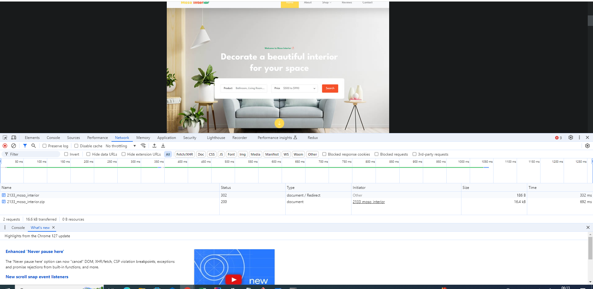
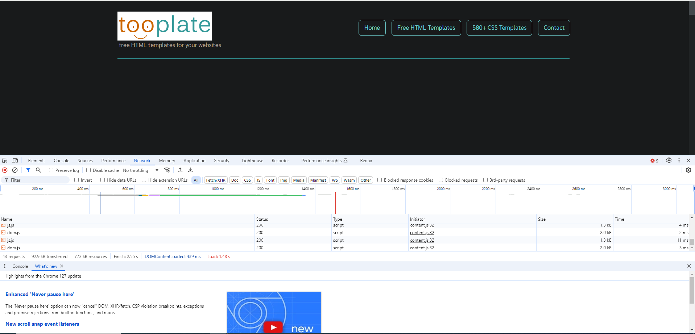
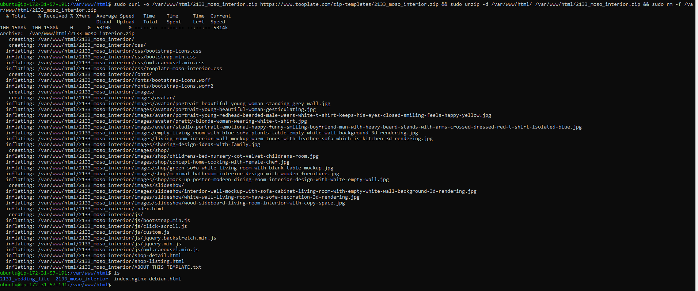
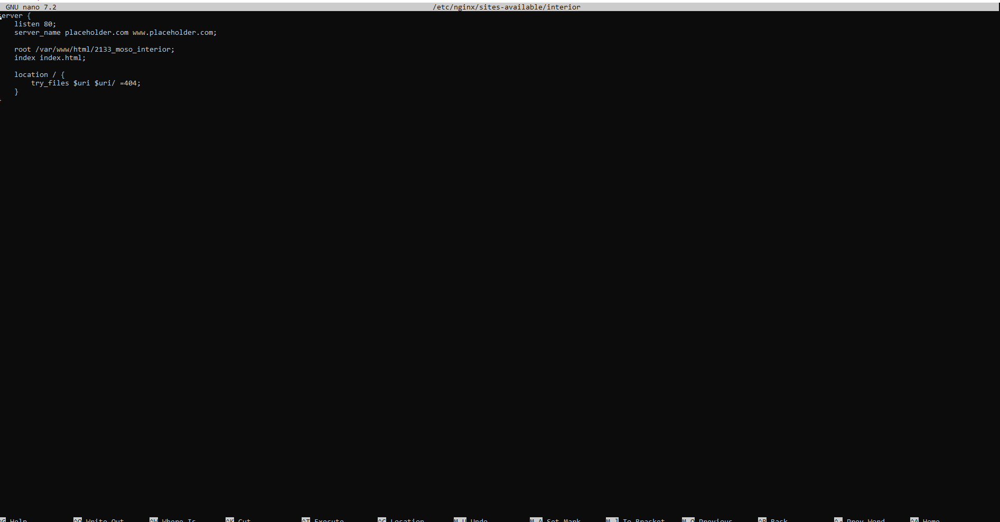
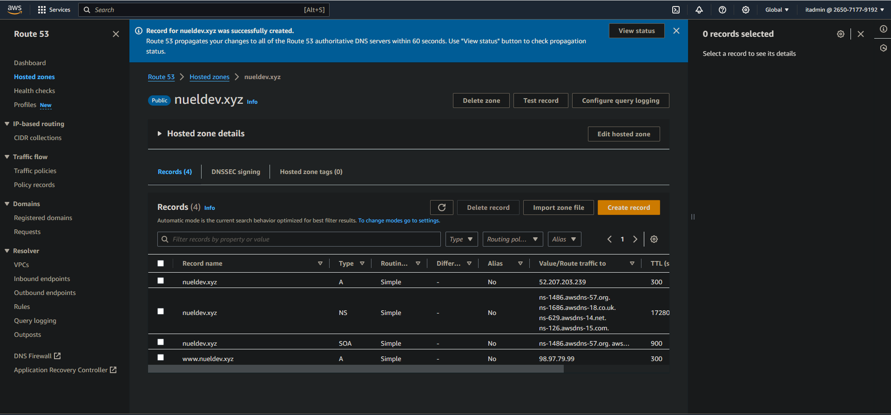
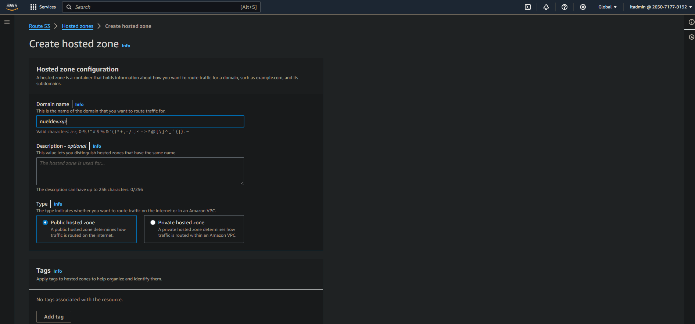
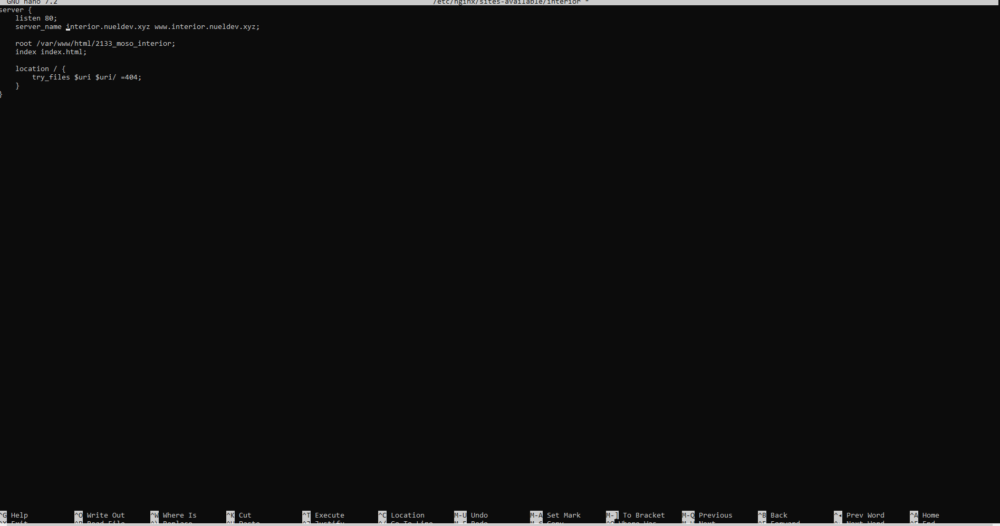
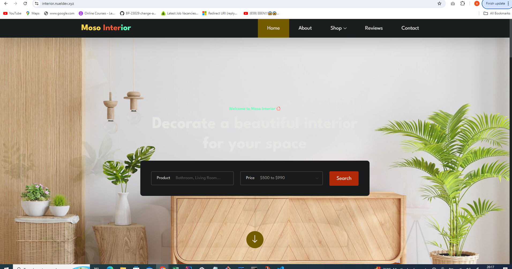
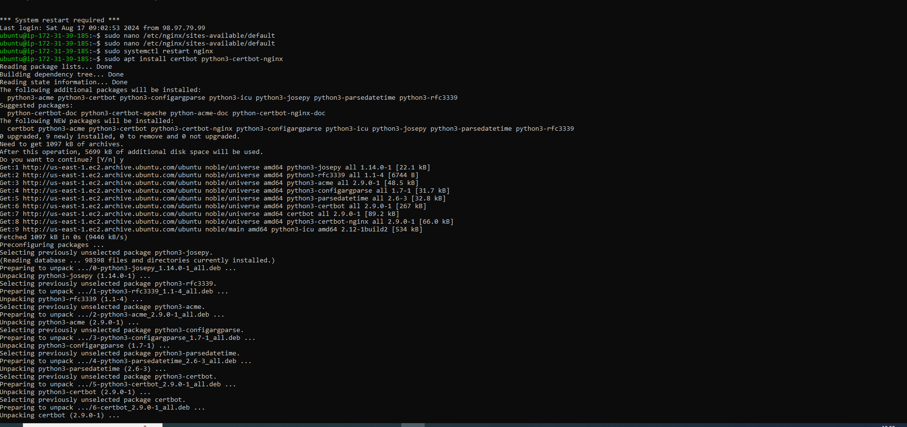
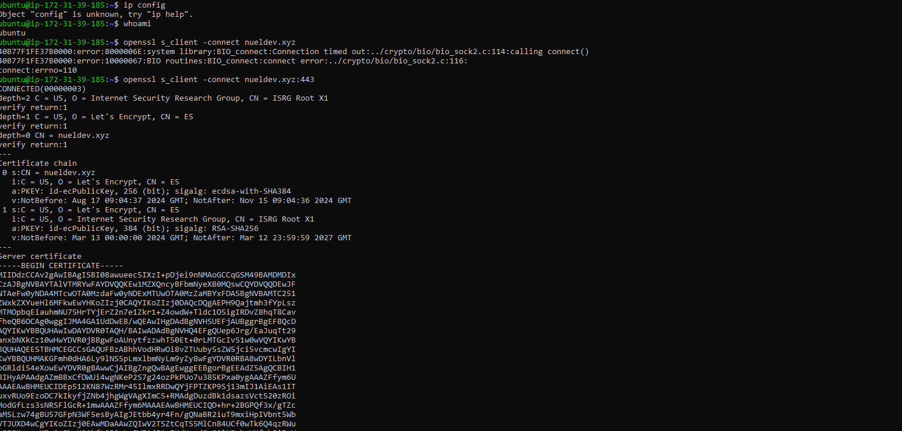

# Seting up Multiple Static Websites on a Single Server Using Nginx Virtual Hosts


## Documentation

Setting up of ubuntu server has been discussed in previous project check [**Project1**](https://github.com/StrangeJay/devops-beginner-bootcamp/blob/main/project1/project1.md) for guidance on spinning up an Ubuntu server, as well as creating and associating an elastic IP address with your server, among other tasks.

- Spin up your ubuntu server, create an elastic IP and associate it to your instance.

### Install Nginx and Setup Your Website

- Execute the following commands.

`sudo apt update`

`sudo apt upgrade`

`sudo apt install nginx`

- Start your Nginx server by running the `sudo systemctl start nginx` command, enable it to start on boot by executing `sudo systemctl enable nginx`, and then confirm if it's running with the `sudo systemctl status nginx` command.

- Visit your instances IP address in a web browser to view the default Nginx startup page.

- Download your website template from your preferred website by navigating to the website, locating the template you want.

- Right click and select **Inspect** from the drop down menu.



- Click on the **Network** tab and then click **Download** button.



- Right click on the website name, select **Copy** and click on **Copy link address**.


- To install the unzip tool, run the following command: **`sudo apt install unzip`**.

- Execute the command to download and unzip your website files `sudo curl -o /var/www/html/2131_wedding_lite.zip https://www.tooplate.com/zip-templates/2131_wedding_lite.zip && sudo unzip -d /var/www/html/ /var/www/html/2131_wedding_lite.zip && sudo rm -f /var/www/html2131_wedding_lite.zip`.



---

**Here's an explanation of the command:**

The command **`sudo curl -o /var/www/html/2098_health.zip https://www.tooplate.com/zip-templates/2131_wedding_lite.zip && sudo unzip -d /var/www/html/ /var/www/html/2131_wedding_lite.zip && sudo rm -f /var/www/html/2131_wedding_lite.zip`** performs a series of actions to download, unzip, and clean up a website template file. Here’s a breakdown of each part of the command:

1. **`sudo curl -o /var/www/html/2098_health.zip https://www.tooplate.com/zip-templates/2131_wedding_lite.zip`**: 
   - `sudo`: Runs the command with superuser (root) privileges.
   - `curl -o /var/www/html/2098_health.zip`: Downloads the file from the specified URL (`https://www.tooplate.com/zip-templates/2131_wedding_lite.zip`) and saves it as `2131_wedding_lite.zip` in the `/var/www/html` directory.

2. **`&&`**: Logical AND operator, which ensures that the next command runs only if the previous command succeeds.

3. **`sudo unzip -d /var/www/html/ /var/www/html/2131_wedding_lite.zip`**:
   - `sudo`: Runs the command with superuser (root) privileges.
   - `unzip -d /var/www/html/`: Extracts the contents of the zip file into the `/var/www/html/` directory.
   - `/var/www/html/2131_wedding_lite.zip`: Specifies the path to the zip file to be unzipped.

4. **`&&`**: Logical AND operator, which ensures that the next command runs only if the previous command succeeds.

5. **`sudo rm -f /var/www/html/22131_wedding_lite.zip`**:
   - `sudo`: Runs the command with superuser (root) privileges.
   - `rm -f`: Removes (deletes) the specified file forcefully (without prompting for confirmation).
   - `/var/www/html/2098_2131_wedding_lite.zip`: Specifies the path to the zip file to be deleted.

In summary, this command downloads the website template file, extracts its contents to the web server directory, and then deletes the downloaded zip file to clean up the directory.

---

- Download the 2nd website template by running the following command:

```
sudo curl -o /var/www/html/2132_clean_work.zip https://www.tooplate.com/zip-templates/2132_clean_work.zip && sudo unzip -d /var/www/html/ /var/www/html/2132_clean_work.zip && sudo rm -f /var/www/html/2132_clean_work.zip
```

> [!NOTE]
Replace the placeholders in the code with your own website URL. For example, substitute **`https://www.tooplate.com/zip-templates/2131_wedding_lite.zip`** with your chosen URL, and change **`2131_wedding_lite.zip`** accordingly.

- To set up your website's configuration, start by creating a new file in the Nginx sites-available directory. Use the following command to open a blank file in a text editor: **`sudo nano /etc/nginx/sites-available/wedding`**


- Copy and paste the following code into the open text editor.

```
server {
    listen 80;
    server_name example.com www.example.com;

    root /var/www/html/example.com;
    index index.html;

    location / {
        try_files $uri $uri/ =404;
    }
}
```

- Edit the `root` directive within your server block to point to the directory where your downloaded website content is stored.



- Configure your second website by creating a new file in the Nginx sites-available directory with the following command: `sudo nano /etc/nginx/sites-available/interior`.


- Copy and paste the following code into the open text editor.

```
server {
    listen 80;
    server_name placeholder.com www.placeholder.com;

    root /var/www/html/placeholder.com;
    index index.html;

    location / {
        try_files $uri $uri/ =404;
    }
}
```

- Edit the **`root`** directive within your server block to point to the directory where your downloaded website content is stored.


- Create a symbolic link for both websites by running the following command.
`sudo ln -s /etc/nginx/sites-available/wedding /etc/nginx/sites-enabled/`
`sudo ln -s /etc/nginx/sites-available/interior /etc/nginx/sites-enabled/`


- Run the **`sudo nginx -t`** command to check the syntax of the Nginx configuration file.

- Delete the default files in the sites-available and sites-enabled directories by executing the following commands:

```
sudo rm /etc/nginx/sites-available/default
sudo rm /etc/nginx/sites-enabled/default
```

- Restart the Nginx server by executing the following command: **`sudo systemctl restart nginx`**.

---

### Create An A Record

To make your website accessible via your domain name rather than the IP address, you'll need to set up a DNS record. I did this by buying my domain from Namecheap and then moving hosting to AWS Route 53, where I set up an A record.

> [!NOTE]
Visit [**Project1**](https://github.com/Nuelsax/devops-bootcamp/blob/main/project1/project1.md) for instructions on how to create a hosted zone.

- In route 53, select the domain name and click on **Create record**.



- Paste your **IP address①** and then click on **Create records②**.



- Click on **Create record** again, to create the record for your sub domain.


- Input the **Record name①**, paste your **IP address②** and then click on **Create records③**.


- Repeat the same process while creating your second subdomain record, and confirm that they both exist in the records list.


- Open your terminal and run **`sudo nano /etc/nginx/sites-available/wedding`** to edit your settings. Enter the name of your domain and then save your settings.



- Run **`sudo nano /etc/nginx/sites-available/interior`** to edit your settings. Enter the name of your domain and then save your settings.


- Restart your nginx server by running the **`sudo systemctl restart nginx`** command.

- Go to your domain name in a web browser to verify that your website is accessible.




> [!NOTE]
You may notice the sign that says **Not secure**. Next, you'll use certbot to obtain the SSL certificate necessary to enable HTTPS on your site.

---

### Install certbot and Request For an SSL/TLS Certificate

- Install certbot by executing the following commands:
`sudo apt update`
`sudo apt install python3-certbot-nginx`
`sudo certbot --nginx`

clear


- Execute the **`sudo certbot --nginx`** command to request your certificate. Follow the instructions provided by certbot and select the domain name for which you would like to activate HTTPS.



> [NOTE]
In this case, SSL certificates were only created for **`interior.nueldev.xyz`** and **`wedding.nueldev.xyz`**. So, when prompted, I entered the numbers 1 and 3 (corresponding to those two domains) to select them for certificate generation. If we had also created records for **`www.wedding.nueldev.xyz`** and **`interior.nueldev.xyz`**, I could have simply pressed Enter to accept the default selection (**all available records**). If you try to create a certificate without having created an A record first, you will receive an error message.

- Verify the website's SSL using the OpenSSL utility with the command: **`openssl s_client -connect www.wedding.nueldev.xyz:443`**


- Visit **`https://<domain name>`** to view your websites.


---
---

#### The End Of Project 2


