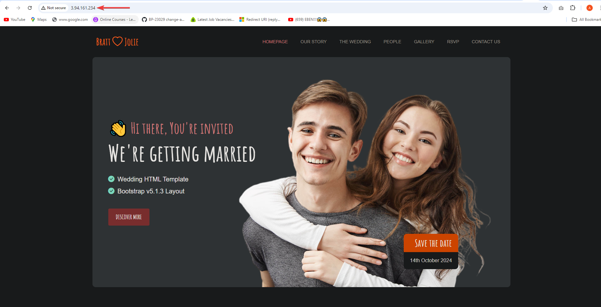

# Project 3: Setup Load Balancing for Static Website Using Nignx
# STEP 1: Create three(3) unbuntu servers on AWS
# Step-by-Step Guide: Creating an Ubuntu Server in AWS
### 1. Log into AWS Console

- Go to [AWS Management Console](https://aws.amazon.com/console/).

- Log in with your AWS credentials.

### 2. Navigate to EC2 Dashboard
- In the AWS Management Console, search for **EC2** and click on it to open the EC2 dashboard.


### 3. Launch an EC2 Instance

- Click the **Launch Instance** button.


### 4. Choose an Amazon Machine Image (AMI)

- In the "Choose an Amazon Machine Image" section, select **Ubuntu Server 22.04 LTS** (or the latest version available).
  - Ensure that the AMI is labeled as **Free Tier eligible** if you are using the AWS Free Tier.

### 5. Select/Create a Key Pair

- In the "Select an existing key pair or create a new key pair" pop-up:
  - Choose **Create a new key pair**.
  - Give it a name (e.g., `ubuntu-key`).
  - Download the key pair (`.pem` file) and store it securely (you will need this to connect to your instance).


### 6. Configure Security Group

- Create a new security group or select an existing one.
- To allow SSH access, ensure you have the following rule:
  - **Type:** SSH
  - **Protocol:** TCP
  - **Port Range:** 22
  - **Source:** Your IP (or allow anywhere with `0.0.0.0/0`, but this is less secure)
  - Click **Launch Instances**.


### 7. Connect to Your Ubuntu Server via SSH

- Open your terminal (Linux/Mac) or use an SSH client (e.g., PuTTY on Windows).
- Run the following command to connect to your instance (replace `your-key.pem` and `your-public-ip` with your key file and the public IP of your instance):

```bash
ssh -i /path/to/your-key.pem ubuntu@your-public-
```
- Spin up your 3 ubuntu servers. Ensure you clearly name them so you don't make mistakes.


# STEP 2: Download the website templates to use and install nginx on servers
### Install Nginx and Setup Your Website

- Download your website template from your preferred website by navigating to the website, locating the template you want.

- Right click and select **Inspect** from the drop down menu.


- Click on the **Network** tab.


- Click the **Download** button and **right click on the website name**.


- Select **Copy** and click on **Copy URL**.


# How to Install, Start, Enable, and Check Nginx Status

This guide provides the steps to install Nginx on a Linux server (Ubuntu), start the service, enable it to start on boot, and check its status.

---

## Step 1: Update the System Packages

Before installing any software, it’s always a good idea to update the package lists for the latest version information.

```bash
sudo apt update
sudo apt upgrade
```

---

## Step 2: Install Nginx

Install Nginx using the package manager `apt`:

```bash
sudo apt install nginx
```

Once the installation is complete, Nginx will be installed on your system.

---

## Step 3: Start the Nginx Service

To start the Nginx service, use the following command:

```bash
sudo systemctl start nginx
```

---

## Step 4: Enable Nginx to Start at Boot

To ensure that Nginx starts automatically when the server boots, use the following command:

```bash
sudo systemctl enable nginx
```

---

## Step 5: Check Nginx Status

To verify that Nginx is running, check its status with the following command:

```bash
sudo systemctl status nginx
```

You should see output indicating that the service is **active (running)**.


- Visit your instances IP address in a web browser to view the default Nginx startup page.
---
- Execute `sudo apt install unzip` to install the unzip tool and run the following command to download and unzip your website files `sudo curl -o /var/www/html/2131_wedding_lite.zip https://www.tooplate.com/zip-templates/2131_wedding_lite.zip && sudo unzip -d /var/www/html/ /var/www/html/2131_wedding_lite.zip && sudo rm -f /var/www/html/2131_wedding_lite.zip`.


- To set up your website's configuration, start by creating a new file in the Nginx sites-available directory. Use the following command to open a blank file in a text editor: `sudo nano /etc/nginx/sites-available/wedding`.
- Copy and paste the following code into the open text editor.

```
server {
    listen 80;
    server_name nueldev.xyz www.nueldev.xyz;

    root /var/www/html/2131_wedding_lite;
    index index.html;

    location / {
        try_files $uri $uri/ =404;
    }
}
```

- Edit the `root` directive within your server block to point to the directory where your downloaded website content is stored.
- Next step is to create a symbolic link for both websites by running the following command.


`sudo ln -s /etc/nginx/sites-available/wedding /etc/nginx/sites-enabled/`


- Run the `sudo nginx -t` command to check the syntax of the Nginx configuration file, and when successful run the `sudo systemctl restart nginx` command.


- Repeat the process for the second website.

> [!NOTE]
On your first server, run `sudo rm /etc/nginx/sites-enabled/default`, and on your second server, run `sudo rm /etc/nginx/sites-enabled/default`. This will delete the default site-enabled folders and enable Nginx to serve content from your specified website directories. If you don't delete these default folders, you'll continue to see the default Nginx page.


- Run the `sudo systemctl restart nginx` command to restart your server.

- Check both IP addresses to confirm your website is up and running.




# How to Configure Nginx as a Load Balancer

This guide provides the steps to configure Nginx as a reverse proxy load balancer. Nginx will distribute traffic to multiple backend servers using a load-balancing algorithm.

---

## Step 1: Install Nginx

If Nginx is not already installed, follow these steps to install it:

```bash
sudo apt update
sudo apt install nginx
```

---

## Step 2: Configure the Nginx Load Balancer

1. Open the Nginx configuration file for editing:

    ```bash
    sudo nano /etc/nginx/nginx.conf
    ```


2. Inside the `http` block, add the following upstream block to define the backend servers (replace `backend1` and `backend2` with your actual server IPs):

    ```nginx
    upstream backend_servers {
        server backend1;
        server backend2;
        # Add more servers as needed
    }
    ```

3. Add a new `server` block to forward incoming traffic to the backend servers:

    ```nginx
    server {
        listen 80;
        server_name your-domain.com;

        location / {
            proxy_pass http://backend_servers;
        }
    }
    ```

---

## Step 3: Check Nginx Configuration Syntax

After making changes, check the Nginx configuration for syntax errors:

```bash
sudo nginx -t
```

---

## Step 4: Restart Nginx

If there are no errors, restart Nginx to apply the changes:

```bash
sudo systemctl restart nginx
```

---

## Step 5: Test the Load Balancer

To confirm that the load balancer is working, visit the IP address or domain in a web browser. Refresh the page several times, and you should see content served from different backend servers.

---
# How to Set Up DNS and Create an A Record in Route 53 on AWS

This guide explains how to configure DNS, create an A record, and move your hosting to AWS Route 53.

---

## Step 1: Purchase a Domain Name

To get started, you'll need a domain name. You can buy a domain from any domain registrar, such as Namecheap, GoDaddy, or directly from AWS Route 53.

---

## Step 2: Move Your Domain Hosting to Route 53

Once you have a domain, you can move its hosting to AWS Route 53.

1. **Log in to AWS Management Console** and navigate to Route 53.
   
2. Click on **Hosted Zones**.

3. **Create a Hosted Zone** for your domain:
   
   - Enter your domain name (e.g., `nueldev.xyz`).
   - Select **Public Hosted Zone**.
   - Click on **Create**.

4. AWS will provide **Name Servers** for your domain. 

5. Go to your domain registrar (where you purchased the domain) and update the **NS (Name Server) records** with the ones provided by AWS.

6. Wait for the DNS propagation, which may take up to 48 hours.

---

## Step 3: Create an A Record in Route 53

Now that your domain is managed by Route 53, you'll create an A record to point the domain to your server’s IP address.

1. In **Route 53**, go to the hosted zone you just created.

2. Click on **Create Record**.

3. **Enter the record details**:
   - **Record Name**: Leave this blank for the root domain (e.g., `nueldev.xyz`). For a subdomain, enter the name (e.g., `www`).
   - **Record Type**: Choose **A - IPv4 address**.
   - **Value**: Enter the public IP address of your server (e.g., your Nginx load balancer or web server).

4. Click on **Create Records**.

---
---

## Step 4: Create a Subdomain A Record (Optional)

If you want to add a subdomain (like `www.nueldev.xyz`), you can create another A record:

1. Go back to your hosted zone in Route 53.
   
2. Click on **Create Record**.

3. **Record Details**:
   - **Record Name**: Enter the subdomain name (e.g., `www`).
   - **Record Type**: Choose **A - IPv4 address**.
   - **Value**: Enter the public IP address of your server.

4. Click on **Create Records**.

Now, both your root domain (`nueldev.xyz`) and subdomain (`www.nueldev.xyz`) will point to your server's IP address.

 Go to your domain name in a web browser to verify that your website is accessible.


- Reload the webpage to ensure the load balancer distributes traffic evenly between your servers.


---
### Install certbot and Request For an SSL/TLS Certificate

- Install certbot by executing the following commands:
`sudo apt update`
`sudo apt install python3-certbot-nginx`

- Execute the `sudo certbot --nginx` command to request your certificate. Follow the instructions provided by certbot and select the domain name for which you would like to activate HTTPS.


- You should get a congratulatory message that says https has been successfully enabled.


- Access your website to verify that Certbot has successfully enabled HTTPS.


- It is recommended to renew your LetsEncrypt certificate at least every 60 days or more frequently. You can test renewal command in dry-run mode:
`sudo certbot renew --dry-run`


---
---
