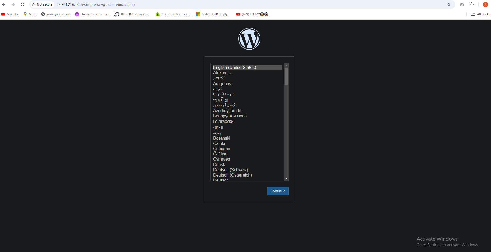

# Project 4: Setup WordPress Website Using LAMP Stack
# Documentation
# Step-by-Step Guide: Creating an Ubuntu Server in AWS
Please reference [**Project1**](https://github.com/Nuelsax/devops-bootcamp/blob/main/project3/project3.md) for guidance on spinning up an Ubuntu server.

# Set an Inbound Rule for MySQL in Your Security Group

When using MySQL on AWS (or any cloud service), you need to allow traffic to MySQL from specific IP addresses or networks by configuring an inbound rule in the security group. Follow these steps to set up the inbound rule for MySQL (port 3306).

## Steps:

### 1. Navigate to the Security Groups
- Go to the **AWS Management Console**.
- Navigate to the **EC2 Dashboard**.
- In the **Network & Security** section, click on **Security Groups**.


### 2. Select the Security Group
- From the list of security groups, select the security group associated with your EC2 instance or MySQL server.


### 3. Edit Inbound Rules
- In the **Inbound rules** tab, click on the **Edit inbound rules** button.


### 4. Add a New Rule
- Click **Add Rule** to create a new rule.
- For **Type**, select **MySQL/Aurora** (which automatically sets the port to 3306).
- For **Protocol**, it will be automatically set to **TCP**.
- For **Port Range**, it should automatically be set to **3306**.
- Under **Source**, you can:
  - Choose **My IP** to allow your current IP address.
  - Choose **Custom** and enter a specific IP address or range (e.g., `192.168.1.0/24`).
  - Choose **Anywhere** (`0.0.0.0/0`) to allow access from any IP, but this is not recommended for security reasons.

### 5. Save the Rule
- Once you've configured the rule, click **Save rules**.


### 6. Verify Connectivity
- After saving the rule, verify that the MySQL service is accessible from the allowed IPs or networks by connecting to the MySQL server using a MySQL client or command-line tool.

- Open your **terminal** and connect to your Ubuntu server via SSH.


### Install Apache
Apache2 is a widely used open-source web server that can be installed easily on Ubuntu. Below are the detailed steps to install and configure Apache2.

## Prerequisites
- You need to have **sudo** or root access on your Ubuntu system.
- Ensure that your package lists are up to date before installing new software.

## Steps to Install Apache2 on Ubuntu

**Update the Package List**  
   Before installing any software, update the package list on your system to ensure you get the latest available version of Apache2. Run the following command in the terminal:
   ```bash
   sudo apt update
   ```
## Install Apache2
- To install Apache2, execute the following command. The -y flag automatically accepts the installation prompt without user interaction:
```bash
   sudo apt install apache2 -y
   ```


## Verify the Apache Installation
- After the installation, you can check if Apache2 is running by using the following command:
```bash
   sudo systemctl status apache2
   ```
- To enable Apache to start on boot, execute:
 ```bash
   sudo systemctl enable apache2
   ```
   ```bash
   sudo systemctl status apache2
   ```
   

- Test how our Apache HTTP server responds to requests from the Internet.*

- Copy your **public IPv4 address** from your EC2 dashboard.

- Open a web browser of your choice and try accessing the following URL: **`http://<Public-IP-Address>:80`**
- If the installation was successful, you should see this page.


## Install MySQL
## Steps to Install MySQL on Ubuntu
1. **Update the Package List**  
   Before installing MySQL, update the package list on your system to ensure you get the latest version:
```bash
   sudo apt update
```

2. **Install MySQL Server**  
   Install the MySQL server package using the following command:
```bash
   sudo apt install mysql-server -y
```
   The `-y` flag automatically confirms the installation prompt.
   

3. **Verify MySQL Installation**  
   After installation, ensure that MySQL is running by checking its status:
```bash
   sudo systemctl status mysql
```
   If MySQL is running, the status will show "active (running)." If not, you can start it manually:
```bash
   sudo systemctl start mysql
```

4. **Secure MySQL Installation**  
   To improve the security of your MySQL installation, run the following security script:
```bash
   sudo mysql_secure_installation
```
This script allows you to remove insecure default settings, set a root password, and more. During the process, you will be prompted to:
- Set a root password (recommended).
- Remove anonymous users.
- Disallow root login remotely.
- Remove test databases.
- Reload privilege tables.
Answer **yes** (`Y`) to all security prompts for a more secure installation.

- After the installation is complete, log in to the MySQL console by typing: **`sudo mysql`**.


- Run the following command to set the password for the root user with the MySQL native password authentication method: **`ALTER USER 'root'@'localhost' IDENTIFIED WITH mysql_native_password BY 'pass';`**. Exit the MySQL shell when you're done by typing **`exit`**.


    
- Start the interactive script by running: **`sudo mysql_secure_installation`①**. Answer **y**② for yes, or any other key to continue without enabling specific options.


- Set your **password validation policy level**.

- Enable MySQL to start on boot by executing **`sudo systemctl enable mysql`①**, and then confirm its status with the **`sudo systemctl status mysql`②** command.

### Install PHP


- Install PHP along with required extensions by running the following script:
```bash
  sudo apt install php-curl php-gd php-mbstring php-xml php-xmlrpc php-soap php-intl php-zip -y
```


```bash
  sudo apt install php libapache2-mod-php php-mysql`
```


- Confirm the downloaded PHP version by running **`php -v`**.


### Creating A Virtual Host For Your Website Using Apache

- Create the directory for Projectlamp using the 'mkdir' command as follows:
**`sudo mkdir /var/www/projectlamp`①** and assign ownership of the directory to our current system user using:
**`sudo chown -R $USER:$USER /var/www/projectlamp`②**.


- Create and open a new configuration file in Apache's sites-available directory using your preferred command-line editor:
**`sudo vi /etc/apache2/sites-available/projectlamp.conf`**.

- Creating this will produce a new blank file. Paste the configuration text provided below into it:

```
<VirtualHost *:80>

ServerName projectlamp

ServerAlias www.projectlamp

ServerAdmin webmaster@localhost

DocumentRoot /var/www/projectlamp

ErrorLog ${APACHE_LOG_DIR}/error.log

CustomLog ${APACHE_LOG_DIR}/access.log combined

</VirtualHost>
```


- Save your changes by pressing the **`Esc`** key, then type **`:wq`** and press **`Enter`**.

- Run the ls command **`sudo ls /etc/apache2/sites-available`①** to show the **new file②** in the sites-available directory.

- We can now enable the new virtual host using the a2ensite command: **`sudo a2ensite projectlamp`**.

- To disable Apache's default website, use the a2dissite command. Type: **`sudo a2dissite 000-default`**.

- To ensure your configuration file doesn’t contain syntax errors, run: **`sudo apache2ctl configtest`**. You should see **"Syntax OK"** in the output if your configuration is correct.
- Finally run: **`sudo systemctl reload apache2`**. This will reload Apache for the changes to take effect.


Our new website is now active, but the web root **`/var/www/projectlamp`** is still empty. Let's create an **`index.html`** file in that location to test that the virtual host works as expected.

- To create the **index.html** file with the content **"Hello LAMP from Nuel"** in the /var/www/projectlamp directory, use the following command: **`sudo echo 'Hello LAMP from devNuel' > /var/www/projectlamp/index.html`**.


- Now, let's open our web browser and try to access our website using the IP address:

**`http://<EC2-Public-IP-Address>:80`**

> [!NOTE]
Replace **`<EC2-Public-IP-Address>`** with your actual EC2 instance's public IP address.


- Remove the index.html file by running the following command: **`sudo rm /var/www/projectlamp/index.html `**

# How to Enable PHP on the Website

By default, Apache gives precedence to an `index.html` file over an `index.php` file. To prioritize `index.php` and make sure it is served before any `index.html` files, you need to modify the Apache configuration file called `dir.conf`. Here’s a step-by-step guide on how to do that.

## Steps to Enable PHP on Apache

1. **Open the `dir.conf` File**  
   Use a text editor such as **nano** or **vi** to edit the `dir.conf` file. This file controls the precedence of index files in Apache. To open the file, run:
   ```bash
   sudo nano /etc/apache2/mods-enabled/dir.conf
   ```

2. **Locate the DirectoryIndex Directive**  
   Inside the `dir.conf` file, locate the `DirectoryIndex` directive. It should look like this by default:
   ```apache
   <IfModule mod_dir.c>
       DirectoryIndex index.html index.cgi index.pl index.php index.xhtml index.htm
   </IfModule>
   ```
   

3. **Prioritize index.php**  
   To prioritize the `index.php` file over the `index.html` file, move `index.php` to the beginning of the list, like this:
   ```apache
   <IfModule mod_dir.c>
       DirectoryIndex index.php index.html index.cgi index.pl index.xhtml index.htm
   </IfModule>
   ```

4. **Save and Exit**  
   After making the changes, save the file and exit the text editor. If you're using **nano**, press `CTRL + O` to save and `CTRL + X` to exit.

5. **Restart Apache**  
   For the changes to take effect, you will need to restart the Apache service. Run the following command:
   ```bash
   sudo systemctl restart apache2
   ```


Now, Apache will prioritize index.php over index.html when both files exist in the same directory.

- To create a new file named index.php inside your custom web root folder (/var/www/projectlamp), you can use the following command to open it in the nano text editor: **`nano /var/www/projectlamp/index.php`**.


- This will create a new file. Copy and paste the following PHP code into the new file:

```
<?php

phpinfo();
```


- Once you've saved and closed the file, go back to your web browser and refresh the page. You should see something like this:


If you can see this page in your browser, then congratulations🎉 your PHP installation is working as expected.
After verifying the relevant information about your PHP server through that page, it's recommended to remove the file you created, as it contains sensitive information about your PHP environment and your Ubuntu server. You can use the rm command to do so:
**`sudo rm /var/www/projectlamp/index.php`**.

You can always recreate this page if you need to access the information again later.

---
# How to Install WordPress on Ubuntu

Once you have set up the LAMP (Linux, Apache, MySQL, PHP) environment, you can start installing WordPress, a popular content management system. Here are the steps to download and install WordPress on your server.

## Steps to Install WordPress

1. **Navigate to the Web Server Root Directory**  
   WordPress files need to be placed in the default web server root directory: `/var/www/html`. Navigate to this directory using the following command:
   ```bash
   cd /var/www/html
   ```

2. **Download the WordPress Installation Files**  
   You can download the latest WordPress files using the `wget` command:
   ```bash
   sudo wget -c http://wordpress.org/latest.tar.gz
   ```

3. **Extract the WordPress Files**  
   Once the download is complete, extract the WordPress archive using the following command:
   ```bash
   sudo tar -xzvf latest.tar.gz
   ```

4. **Confirm the WordPress Directory**  
   After extracting the files, run the `ls -l` command to check if the `wordpress` directory has been created in `/var/www/html`:
   ```bash
   ls -l
   ```
   You should see the `wordpress` directory in the output.

5. **Set Ownership of the WordPress Files**  
   To ensure that WordPress can be managed by the web server, the files must be owned by the user running the web server. On Ubuntu and Debian systems, the default web server user is often `www-data`.
   

6. **Check the Web Server User**  
   To confirm the user that is running your web server, run the following command:
   ```bash
   ps aux | grep apache | grep -v grep
   ```
   This will display information about the processes related to Apache and the user running those processes.

7. **Grant Ownership to the Web Server User**  
   Once you’ve confirmed the web server user (which is likely `www-data`), grant ownership of the WordPress directory and its files to that user:
   ```bash
   sudo chown -R www-data:www-data /var/www/html/wordpress
   ```
   

---

## Conclusion
At this point, WordPress is downloaded, extracted, and properly configured for your web server to manage. The next steps involve setting up the WordPress configuration and completing the installation via the web interface


### Create a Database For Wordpress

- Access your MySQL root account with the following command: **`sudo mysql -u root -p`①**. Enter the **password②** you set earlier when prompted.


- To create a separate database named wp_db for WordPress to manage, execute the following command in the MySQL prompt: **`CREATE DATABASE wp_db;`**

> [!NOTE]
This command allows you to create a new database (**wp_db**) within your MySQL environment. Feel free to name it as you prefer.

- To access the new database, you can create a MySQL user account with a strong password using the following command:
**`CREATE USER nuel@localhost IDENTIFIED BY 'wp-password';`**

*Replace 'wp-password' with your preferred strong password for the MySQL user account.*

- To grant your created user (nuel@localhost) all privileges needed to work with the wp_db database in MySQL, use the following commands:

```
GRANT ALL PRIVILEGES ON wp_db.* TO nuel@localhost;
FLUSH PRIVILEGES;
```


> [!NOTE]
This grants all privileges **(ALL PRIVILEGES)** on all tables within the wp_db database **(`wp_db.*`)** to the user nuel when accessing from localhost. The FLUSH PRIVILEGES command ensures that MySQL implements the changes immediately. Adjust the database name **(wp_db)** and username **(nuel)** as per your setup.

- Type **`exit`** to exit the MySQL shell.

- Grant executable permissions recursively (-R) to the wordpress folder using the following command: **`sudo chmod -R 777 wordpress/`**


### Configure Wordpress

Once you've established a database for WordPress, the next crucial step is setting up and configuring WordPress itself. To begin, you'll need to create a configuration file tailored for WordPress.

- Rename the sample WordPress configuration file with the command: **`mv wp-config-sample.php wp-config.php`**.

- Edit the **`wp-config.php`** file using the command: **`sudo nano wp-config.php`**.


- Update the database settings in the **`wp-config.php`** file by replacing placeholders like **database_name_here**, **username_here**, and **password_here** with your actual database details.


- Modify the configuration file projectlamp.conf: **`sudo nano /etc/apache2/sites-available/projectlamp.conf`** to update the document root to the directory where your WordPress installation is located.


- After updating the document root to **`/var/www/html`** directory in your editor, save the changes and exit.

- Reload Apache for the changes to take effect: **`sudo systemctl reload apache2`**.

- Once you've completed these steps, you can access your WordPress page to complete the installation. Open your web browser and go to **`http://<EC2 IP>/wordpress/`**. This will lead you to the WordPress setup wizard where you can finalize the installation process.

> [!NOTE]
Replace **<EC2 IP>** with the IP address of your EC2 instance when accessing your WordPress page.

- Select your preferred language and then click on **Continue** to proceed.



- Enter the required information and click on **Install WordPress** once you have finished.

  - **Site Title①:** Enter the name of your WordPress website. It's recommended to use your domain name for better optimization.
  - **Username②:** Choose a username for logging into WordPress.
  - **Password③:** Set a secure password to protect your WordPress account.
  - **Your email④:** Provide your email address to receive updates and notifications.
  - **Search engine visibility⑤:** You can leave this box unchecked to prevent search engines from indexing your site until it's ready.


- WordPress has been successfully installed. You can now log in to your admin dashboard using the previously set up information by clicking the **Log In** button.


- Enter your username and password, then click **Log In** to access your WordPress admin dashboard.

- Once you successfully log in, you will be greeted by the WordPress dashboard page.


### Create An A Record
Please reference [**Project1**](https://github.com/Nuelsax/devops-bootcamp/blob/main/project3/project3.md) for instructions on how to create a hosted zone an A Record.

- To update your Apache configuration file in the sites-available directory to point to your domain name, use the command: **`sudo nano /etc/apache2/sites-available/projectlamp.conf`**.

> [!NOTE]
This command opens the **`projectlamp.conf`** file in the nano text editor with superuser privileges **(`sudo`)**. Within the editor, adjust the necessary details to reflect your domain name configuration.

- Ensure that the server settings in your Apache configuration point to your domain name, and that the document root accurately points to your WordPress directory. Once you've made these adjustments, save the changes and exit the editor.

```
<VirtualHost *:80>
    ServerName <Your root domain name>
    ServerAlias <Your sub domain name>
    ServerAdmin webmaster@<Your root domain name>

    DocumentRoot /var/www/html/wordpress

    <Directory /var/www/html/wordpress>
        Options Indexes FollowSymLinks
       # AllowOverride All
        Require all granted
    </Directory>

    ErrorLog ${APACHE_LOG_DIR}/error.log
    CustomLog ${APACHE_LOG_DIR}/access.log combined
</VirtualHost>

```

- Reload your Apache server to apply the changes with the command: **`sudo systemctl reload apache2`**, After reloading, visit your website at **`http://<domain name>`** to view your WordPress site. Replace **<domain name>** with your actual domain name.


- To log in to your WordPress admin portal, visit **`http://<domain name>/wp-admin`**, Enter your **username①** and **password②**, then click on **log In③**. *Replace **<domain name>** with your actual domain name.*


> [!NOTE]
My domain name is **nueldev.xyz**, so i'll visit **`http://nueldev.xyz/wp-admin`**.

- Now that your WordPress site is successfully configured to use your domain name, the next step is to secure it by requesting an SSL/TLS certificate.


### Install certbot and Request For an SSL/TLS Certificate

- Install certbot by executing the following commands:
`sudo apt update`
`sudo apt install certbot python3-certbot-apache`

- Run the command **`sudo certbot --apache`** to request your SSL/TLS certificate. Follow the instructions provided by Certbot to select the domain name for which you want to enable HTTPS.

- You should receive a message confirming that the certificate has been successfully obtained.


- Visit your website to confirm, and you'll notice that the **"not secure"** warning no longer appears, indicating that your site is now secure with HTTPS.


---